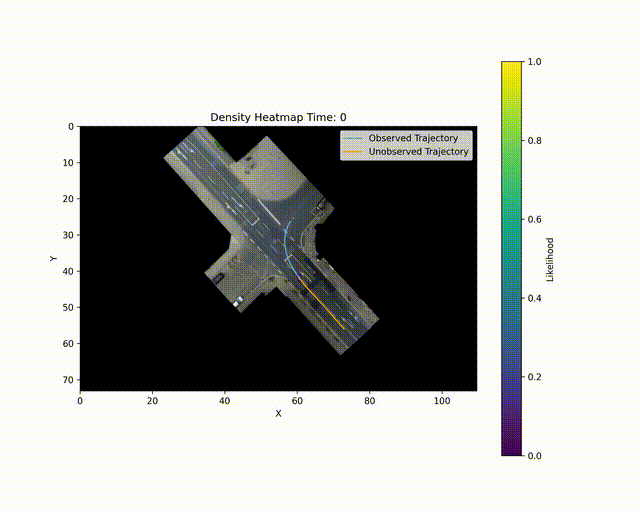

# TrajFlow
Official repository of the [TrajFlow](https://arxiv.org/abs/2501.14266) paper.



# Installation

The code in this repository was implemented against python 3.9. Use the following commands to install the dependecy packackes.

```bash
pip3 install torch --index-url https://download.pytorch.org/whl/cu118
pip install torchdiffeq wandb numpy pandas matplotlib
```

This repository contains a Dockerfile that can be used to setup a clean environment.

# Training

To train a model from scratch you need to edit main.py. In particular you need to ensure that the should_train variable is set to true. should_train is located at the top of the file. There are four possible configuration of the TrajFlow architecture. GRU-DNF, GRU-CNF, CDE-DNF, and CDE-CNF. GRU/CDE refer to the encoder architecture. GRU is a discrete recurrent neural network while CDE is a continous neural differential equation. Likewise DNF/CNF refers to the normalizing flow architecture where DNF is discrete and CNF is continous. You can configure the encoder and flow architecture by editing the default run config in main.py to the appropriate values. In order to save your model weights should_serialize must be set to true.

# Inference

You can evaluate the model on the validation split by setting should_evaluate to true. You can also visualize estimated densities of samples in the validation split by setting should_visualize to true. In order to visualize ffmpeg must be installed and located in the root directory.


